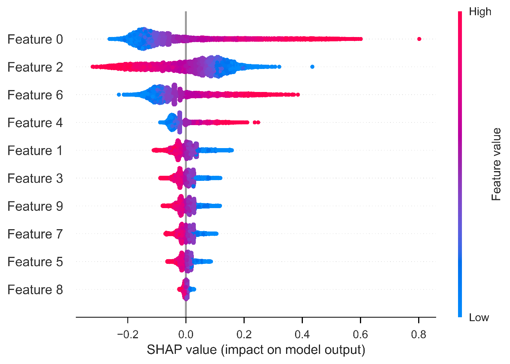

<h2 align="center">
  EnrichRBP: an automated and interpretable web server for high-throughput RNA-binding protein events prediction, visualization and analysis
</h2>

<p align="center">
  <a href="https://github.com/wangyb97/EnrichRBP">
    
  </a>
  <a href="https://github.com/wangyb97/EnrichRBP/stargazers">
    
  </a>
  <a href="https://github.com/wangyb97/EnrichRBP/network/members">
    
  </a>
  <a href="https://github.com/wangyb97/EnrichRBP/issues">
    
  </a>
  <a href="https://github.com/wangyb97/EnrichRBP/blob/master/LICENSE">
    
  </a>
  
  <!-- ALL-CONTRIBUTORS-BADGE:START - Do not remove or modify this section -->
<a href="https://github.com/wangyb97/EnrichRBP#contributors-"></a>
<!-- ALL-CONTRIBUTORS-BADGE:END -->
</p>

***EnrichRBP*** is the first automated and interpretable platform designed for the prediction and analysis of RBP binding sites across **circRNAs, linear RNAs and RNAs in various cellular contexts**.
Currently, EnrichRBP includes **[28 RNA sequence characterization methods](#list-of-implemented-methods)**, including three classes of characterization views: dynamic and static semantic information, RNA secondary structure information and RNA physicochemical properties.
***EnrichRBP*** provides four **advanced features**:

- :book: Unified, easy-to-use APIs.
- :book: Capable for out-of-the-box ***RNA-RBP binding event*** characterization and downstream experiments.
- :book: Powerful, customizable performance and feature analysis visualizer.
- :book: Full compatibility with other popular packages like [scikit-learn](https://scikit-learn.org/stable/) and [yellowbrick](https://www.scikit-yb.org/en/latest/index.html).

## Generating features using EnrichRBP with 7 Lines of Code:

```python
# Generate RNA physicochemical properties
from EnrichRBP.Features import generateBPFeatures
from EnrichRBP.featureSelection import cife
from EnrichRBP.metricsPlot import shap_interaction_scatter
bp_features = generateBPFeatures(sequences, PGKM=True)

# Filter the original features
refined_features = cife(bp_features, label, num_features=10)

# Performance visualization of SVM using EnrichRBP
clf = SVC(probability=True)
shap_interaction_scatter(refined_features, label, clf=clf, sample_size=(0, 100), feature_size=(0, 10), image_path='./')
```

## Table of Contents

- [Table of Contents](#table-of-contents)
- [Installation](#installation)
- [Example Usage](#example-usage)
- [Highlights](#highlights)
- [List of implemented methods](#list-of-implemented-methods)


## Installation

It is recommended to use **git** for installation.
```shell
$ conda create -n EnrichRBP python=3.7.6            # create a virtual environment named EnrichRBP
$ conda activate EnrichRBP                          # activate the environment  
$ git clone https://github.com/wangyb97/EnrichRBP.git # clone this repository
$ cd EnrichRBP
$ pip install -r requirement.txt               # install the dependencies of EnrichRBP
```
After this, the torch also needs to be installed separately according to the cuda version of your device, e.g. CUDA 10.2 can be used with the following command.
```shell
$ pip install torch==1.8.1+cu102 torchvision==0.9.1+cu102 torchaudio==0.8.1 -f https://download.pytorch.org/whl/torch_stable.html
```
scikit-feature can be installed in a virtual environment with the following command 
```shell
git clone https://github.com/jundongl/scikit-feature.git
cd scikit-feature
python setup.py install
```

The language models used in EnrichRBP can be downloaded from [figshare](https://figshare.com/articles/software/The_language_models_used_in_EnrichRBP/25549387)

Note for OSX users: due to its use of OpenMP, glove-python-binary does not compile under Clang. To install it, you will need a reasonably recent version of `gcc` (from Homebrew for instance). This should be picked up by `setup.py`.
```shell
git clone https://github.com/maciejkula/glove-python.git
cd glove-python
python setup.py install
```


EnrichRBP requires following dependencies:

- [Python](https://www.python.org/) (>=3.6)
- [gensim](https://radimrehurek.com/gensim/index.html) (>=3.8.3)
- [GloVe](https://pypi.org/project/glove-python-binary/) (>=0.2.0)
- [numpy](https://numpy.org/) (>=1.19.5)
- [pandas](https://pandas.pydata.org/) (>=1.3.5)
- [scipy](https://www.scipy.org/) (>=0.19.1)
- [joblib](https://pypi.org/project/joblib/) (>=0.11)
- [scikit-learn](https://scikit-learn.org/stable/) (>=0.24.2)
- [matplotlib](https://matplotlib.org/) (>=3.5.3) 
- [seaborn](https://seaborn.pydata.org/) (>=0.11.2)
- [shap](https://shap.readthedocs.io/en/latest/index.html) (>=0.41.0)
- [skfeature](https://jundongl.github.io/scikit-feature/index.html) (>=1.0.0)
- [tensorflow-gpu](https://tensorflow.google.cn/) (>=2.4.0)
- [torch](https://pytorch.org/) (>=1.8.1)
- [transformers](https://huggingface.co/docs/transformers/index) (4.12.5)
- [yellowbrick](https://www.scikit-yb.org/en/latest/index.html) (>=1.3)
- [tqdm](https://tqdm.github.io/) (>=4.64.0)


## Example Usage

This example illustrates the basic usage of `EnrichRBP`, including loading the dataset, generating features, feature selection, training the model, and performance and feature analysis.

This example uses:

- `EnrichRBP.filesOperation`
- `EnrichRBP.Features`
- `EnrichRBP.evaluateClassifiers`
- `EnrichRBP.metricsPlot`
- `EnrichRBP.featureSelection`

```python
from EnrichRBP.filesOperation import read_fasta_file, read_label
from EnrichRBP.Features import generateDynamicLMFeatures, generateStaticLMFeatures, generateStructureFeatures, generateBPFeatures
from EnrichRBP.evaluateClassifiers import evaluateDLclassifers
from EnrichRBP.metricsPlot import violinplot, shap_interaction_scatter
from EnrichRBP.featureSelection import cife
from sklearn.svm import SVC
```

### Load the dataset

Load a AGO1 dataset as example.

```python
# Define the path where the dataset locates.
fasta_path = '/home/wangyubo/code/EnrichRBP/src/RNA_datasets/circRNAs/AGO1/seq'
label_path = '/home/wangyubo/code/EnrichRBP/src/RNA_datasets/circRNAs/AGO1/label'

sequences = read_fasta_file(fasta_path)  # Read sequences and labels from the given path
label = read_label(label_path)
```

### Generate features for sequences

We generate three types of features as examples, in generating biological features, we generate Positional gapped k-m-tuple pairs (PGKM) features, in generating semantic information, we process the sequence as 4mer in dynamic model, while in static model, we process the sequence as 3mer and use fasttext as the model for embedding extraction.

```python
biological_features = generateBPFeatures(sequences, PGKM=True)  # generate biological features

bert_features = generateDynamicLMFeatures(sequences, kmer=4, model='/home/wangyubo/code/EnrichRBP/src/dynamicRNALM/circleRNA/pytorch_model_4mer')  # generate dynamic semantic information

static_features = generateStaticLMFeatures(sequences, kmer=3, model='/home/wangyubo/code/EnrichRBP/src/staticRNALM/circleRNA/circRNA_3mer_GloVe') # static semantic information

structure_features = generateStructureFeatures(fasta_path, script_path='/home/wangyubo/code/EnrichRBP/src/RNAplfold', basic_path='/home/wangyubo/code/EnrichRBP/src/circRNAsAGO1', W=101, L=70, u=1)  # generate secondary structure information
```

### Perform feature selection to refine the biological features

We take the cife method as example.

```python
print(biological_features.shape)
refined_biological_features = cife(biological_features, label, num_features=10)  # refine the biologcial_feature using cife feature selection method
print(refined_biological_features.shape)
```

The output of the above code is as follows:

> ```
> (34636, 400)
> (34636, 10)
> ```

### Evaluate deep/machine learning classifier

We take the deep learning models as example.

```python
evaluateDLclassifers(bert_features, folds=10, labels=label, file_path='./', shuffle=True) # 10-fold cross-validation of deep learning models using dynamic semantic information
```

After the function finishes running, a `DL_evalution_metrics.csv` will be saved in the path specified by `file_path`, with the following format.

> ```
> clf_name,metrics,metric_name
> CNN,0.999745345,AUC
> CNN,0.995525096 ACC
> CNN,0.991053703,MCC
> CNN,0.994975596,Recall
> CNN,0.9955248,F1_Scores
> RNN,0.998232352,AUC
> RNN,0.988452081,ACC
> RNN,0.976941921,MCC
> RNN,0.983881982,Recall
> RNN,0.988370228,F1_Scores
> ResNet,0.999630465,AUC
> ResNet,0.995900484,ACC
> ResNet,0.991807785,MCC
> ResNet,0.994295177,Recall
> ResNet,0.995894144,F1_Scores
> MLP,0.988894799,AUC
> MLP,0.935463968,ACC
> MLP,0.867734521,MCC
> MLP,0.978133195,Recall
> MLP,0.951769181,F1_Scores
> ```

### Visualize performance and feature analysis

We use the SVM trained with refined_biological_features for feature shap value calculation as an example.

```python
clf = SVC(probability=True)
shap_beeswarm(features, labels, clf, sample_size=(0, 10000), feature_size=(0, 10), image_path=file_path) # Plotting the importance of biological features in SVM using beeswarm plot
```

An `shap_beeswarm.png` will be saved under `file_path`, as follows:


## Highlights

- :book: ***Unified, easy-to-use APIs***
The functions in each module in EnrichRBP have individual unified APIs. 
- :book: ***Extended functionalities, wider application scenarios.***
*EnrichRBP provides interfaces for conducting downstream **RNA-RBP binding event** experiments,* including feature selection, model cross validation, feature and performance analysis visualization.
- :book: ***Detailed training log, quick intuitive visualization.***
We provide additional parameters in characterization functions for users to control the window to capture information of different views they want to monitor during the sequence encoding. We also implement an `metricsPlot` to quickly visualize the results of feature analysis or model evaluation for providing further information/conducting comparison.
- :book: ***Wide compatiblilty.***
IMBENS is designed to be compatible with [scikit-learn](https://scikit-learn.org/stable/) (sklearn) and also other projects like [yellowbrick](https://www.scikit-yb.org/en/latest/index.html). Therefore, users can take advantage of various utilities from the sklearn community for cross validation or result visualization, etc.

## List of implemented methods

**Currently (v0.1.0, 2024/04), *28* RNA-RBP binding event characterization methods were implemented:**

- **RNA-RBP binding semantic based**
  - *Dynamic global semantic information*
    1. **[`RNABERT`]**
  - *Static local semantic information*
    1. **[`FastText`]**
    2. **[`GloVe`]**
    3. **[`Word2Vec`]**
    4. **[`Doc2Vec`]**
- **RNA secondary structure based**
  - *Secondary structure information*
- **RNA physicochemical properties**
  - *pseudoKNC*
  - *zigzag coding*
  - *Guanine cytosine Quantity*
  - *Nucleotides tilt*
  - *Percentage of bases*
  - *Positional gapped k-m-tuple pairs*
  - *DPCP*

> **Note: `EnrichRBP` will be continuously updated and is committed to creating a comprehensive and accurate webserver platform for RNA-RBP binding events.**

## Contact:
Thank you for using EnrichRBP! Any questions, suggestions or advices are welcome.

email address:[lixt314@jlu.edu.cn](lixt314@jlu.edu.cn), [yubo23@mails.jlu.edu.cn](yubo23@mails.jlu.edu.cn)
